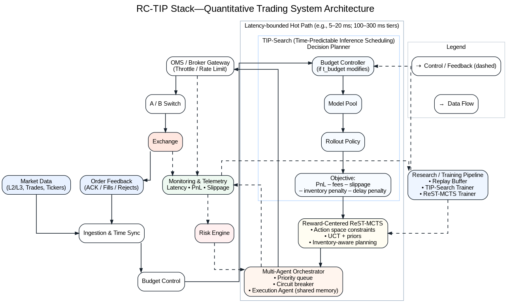

# RC-TIP Stack: Quantitative Trading System Architecture

**RC-TIP Stack** is a next-generation **quantitative trading system architecture**, designed to achieve **time-predictable inference** and **robust decision-making** in high-frequency and intraday trading environments.

It integrates three core research-driven modules into a single stack:

- **Reward-Centered ReST-MCTS** – a planning framework for robust decision-making under uncertainty.  
- **TIP-Search** – a deadline-aware inference scheduling algorithm ensuring predictability of latency-sensitive strategies.  
- **Multi-Agent Orchestrator** – priority-aware orchestration, monitoring, and risk control across heterogeneous trading modules.  

---

## 🔑 Key Features

- **Latency-bounded inference**: Guarantee inference within strict latency budgets (e.g., 5–20 ms).  
- **Robust Decision Framework**: Monte Carlo Tree Search with reward-centered rollout, inventory prediction, and execution-aware planning.  
- **Multi-Agent Coordination**: Priority-based orchestration of execution strategies, fail-safe fallback, and real-time monitoring.  
- **End-to-End Integration**: From raw market data (L2/L3 order books, trades, tickers) to order feedback and risk management.  

---

## 🏗️ System Architecture

<p align="center">
  
</p>

The architecture highlights a *latency-bounded hot path* that guarantees predictable performance under millisecond deadlines.  

---

## 📚 Research Background

RC-TIP Stack is grounded on peer-reviewed research and ongoing academic work:

- [Reward-Centered ReST-MCTS: A Robust Decision-Making Framework for Robotic Manipulation in High Uncertainty Environments](https://arxiv.org/abs/2503.05226)  
- [TIP-Search: Time-Predictable Inference Scheduling for Market Prediction under Uncertain Load](https://arxiv.org/abs/2506.08026)  

---

## 🔒 Availability

RC-TIP Stack is **private and closed-source**.  
We currently do **not provide source code**, but share research outputs, architecture designs, and performance reports for academic and industrial collaboration.  

📩 For inquiries regarding **collaboration, partnerships, or licensing discussions**, please contact via:  
**milesywong@gmail.com**  

---

## ✍️ Citation

If you reference RC-TIP Stack in research or technical discussions, please cite:  

```bibtex
@misc{wang2025rctip,
  title = {RC-TIP Stack: Quantitative Trading System Architecture},
  author = {Wang, Xibai},
  year = {2025},
  note = {Private repository, for promotional purposes}
}
